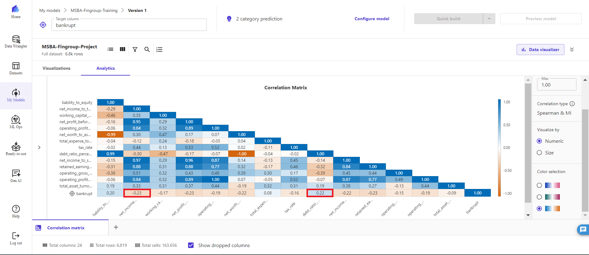
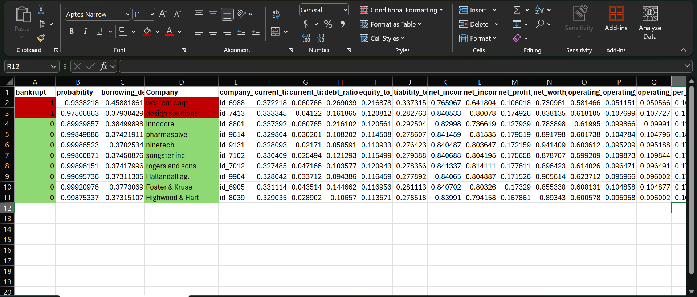
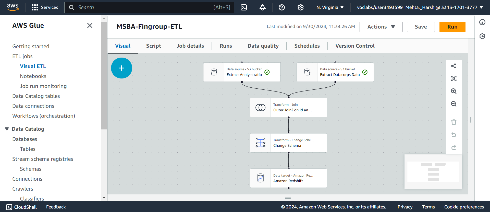
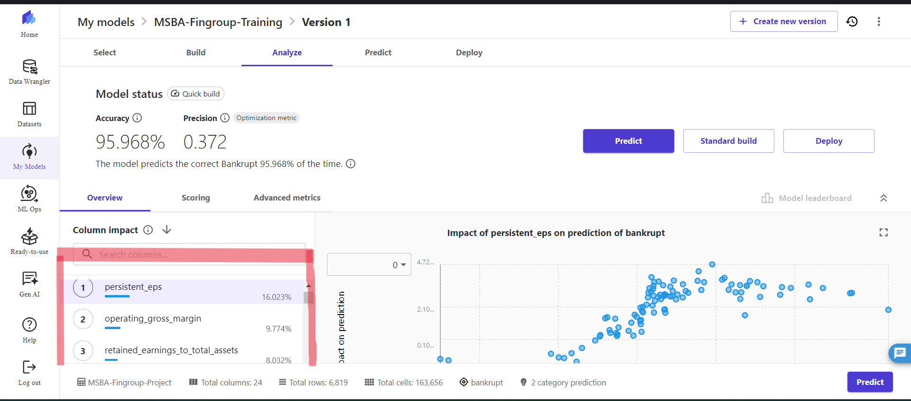

# MSBA Financial Group: Cloud-Native Bankruptcy Risk Pipeline

An end-to-end AWS data pipeline that ingests financial data on 6,800+ companies, runs it through ETL and a machine learning model, and produces a ranked list of bankruptcy risks for an investment team to act on.

Built on S3, Glue, Redshift, and SageMaker Canvas. The model hits 95.968% accuracy. The output is a CSV of companies flagged as high-risk or safe, with the actual business decision already made: two companies to avoid, eight to invest in.


## The problem

MSBA Financial Group had financial data scattered across three sources (company financials, accounting ratios, bankruptcy history) and no way to ask a simple question: which of these 6,800 companies are likely to go bankrupt, and which should we put money into?

Solving this meant three things had to happen in one pipeline. The data had to land somewhere durable and cheap. It had to be cleaned, joined, and reshaped into a format a model could learn from. And the model's output had to come back out the other end as a file a human analyst could open in Excel and make a decision with.

## How the pipeline works

**Ingest.** Three CSVs land in S3 buckets: `MSBA_Datacorp_financial_data.csv`, `msba_fg_ratio_data.csv`, and `MSBA_fingrp_bankruptcy.txt`. S3 is the data lake, the landing zone, the cheap durable place where raw data sits before anyone transforms it.

**Transform.** AWS Glue picks up the files and runs a visual ETL job: two S3 sources get outer-joined on company ID, schemas get normalized, and the joined result gets written to Redshift. Separately, a third file of unlabelled company profiles gets prepared for scoring.



**Warehouse.** Two Redshift tables hold the training data (labelled with bankruptcy outcomes) and the inference data (unlabelled company profiles to predict on). Redshift is where the data stops being "dumped files" and starts being queryable.

**Model.** SageMaker Canvas pulls from Redshift, runs EDA with correlation matrices and column impact analysis, and trains a two-category classifier on the labelled data. The top predictive features turn out to be `persistent_eps` (16% column impact), `operating_gross_margin` (9.8%), and `retained_earnings_to_total_assets` (8.0%). None of those are surprising to anyone who's read a balance sheet, which is a good sign; the model is picking up real signal.



**Deliver.** Canvas writes predictions back to S3 as `Final_Bankruptcy_Prediction.csv`. Each row gets a `bankrupt` flag (0 or 1) and a probability. Conditional formatting in Excel turns the file into something a portfolio manager can scan in thirty seconds.



## What the data said

Of the ten companies the model evaluated for recommendation:

**Avoid.** Western Corp and Design Solutions, both flagged with bankruptcy probability above 0.93.

**Safe.** Innocore, Pharmasolve, Ninetech, Songster Inc, Rogers and Sons, Hallandall Ag., Foster & Kruse, and Highwood & Hart, all with bankruptcy probability below 0.005.

That's the whole point of the pipeline. The infrastructure is interesting. The CSV on the other end is what pays for it.

## EDA highlights

Correlation analysis in SageMaker surfaced two relationships worth calling out: `debt_ratio_percentage` at +0.22 correlation with bankruptcy (higher debt, higher risk, as you'd expect) and `net_income_to_total_assets` at -0.23 (profitable companies are less likely to go under). Nothing revolutionary, but worth verifying with real data rather than assuming.



## Architecture decisions worth flagging

**Why two Redshift tables instead of one?** Separating labelled training data from unlabelled inference data keeps the ML boundary clean. You don't want training leakage because someone accidentally queried the wrong view.

**Why Glue visual ETL instead of a Python script?** For a project of this shape, the visual DAG is more honest. Anyone on the team can open the job, see the join and the schema transform, and understand what's happening. A 200-line pandas script would hide the same logic behind author-specific idioms.

**Why Canvas over a custom SageMaker notebook?** Because the business question (will this company go bankrupt?) deserved a fast answer, not a three-week tuning cycle. Canvas gave us 95.968% accuracy on a standard tabular problem. If the accuracy floor had been 75%, that would be the right moment to drop down into XGBoost or a PyTorch tabular model. It wasn't.

## Repo contents

```
.
├── README.md
├── LICENSE
├── .gitignore
├── Data_Architecture_-_Final.png       the high-level diagram
├── aws_de_msba6.png                    Glue visual ETL job
├── aws_de_msba8.png                    SageMaker correlation matrix
├── aws_de_msba9.png                    SageMaker model accuracy
├── aws_de_msba_010.png                 final predictions in Excel
└── Harsh_Cloud_Project.pptx            the original deck
```

## Tools

AWS S3, AWS Glue, AWS Redshift, AWS SageMaker Canvas, Excel for the final deliverable.

## Context

Built as part of the MSBA program, 2024. The pipeline was designed for a simulated financial services client, but the data and the model accuracy are honest.
